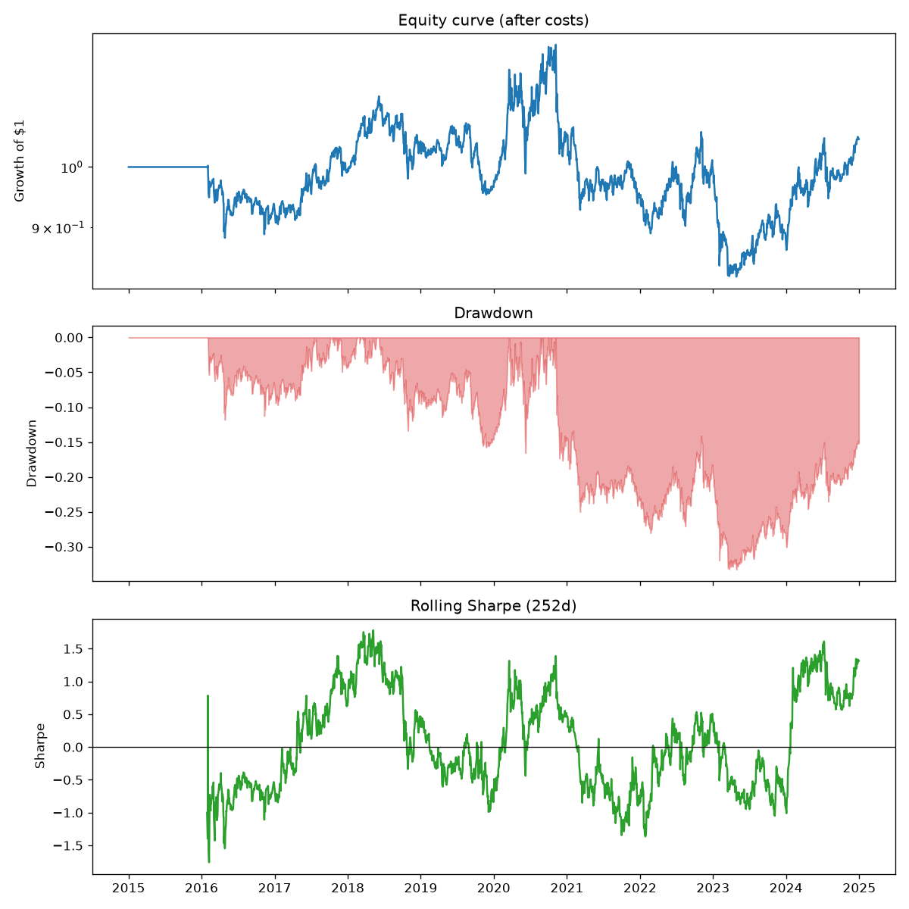
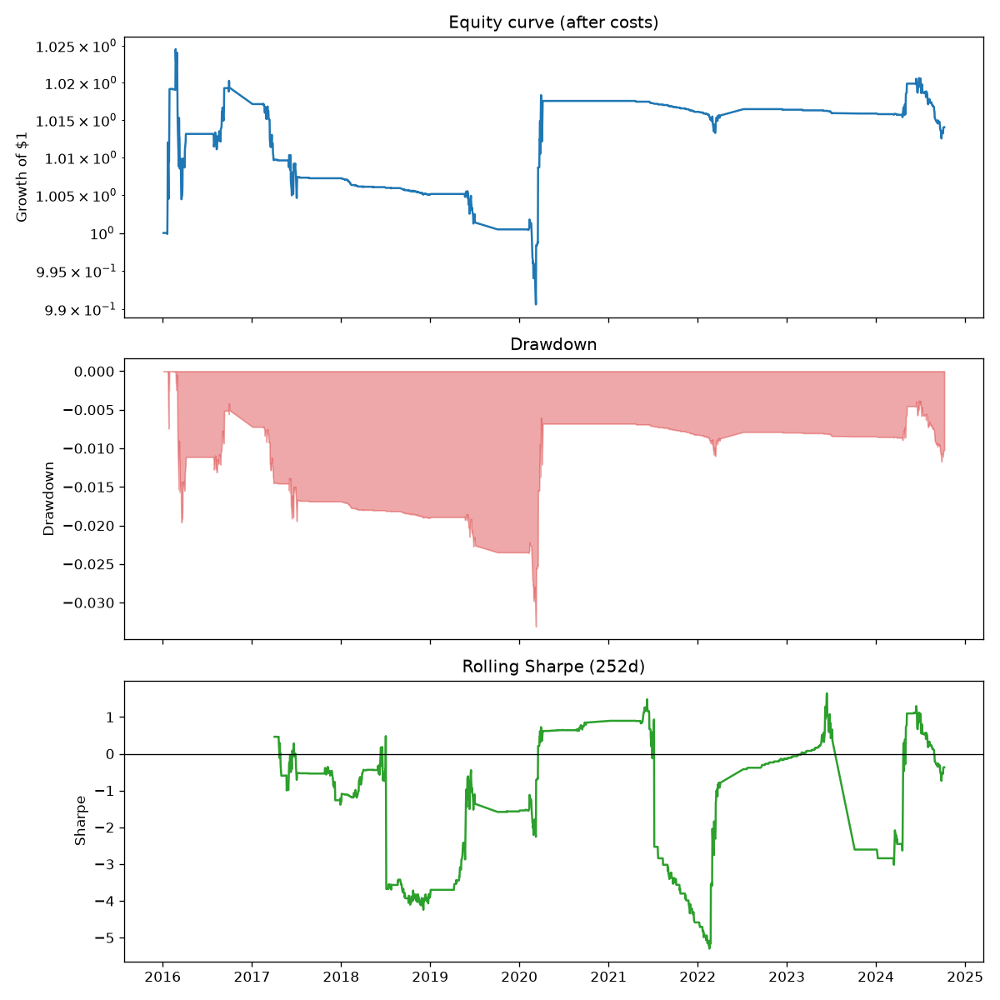
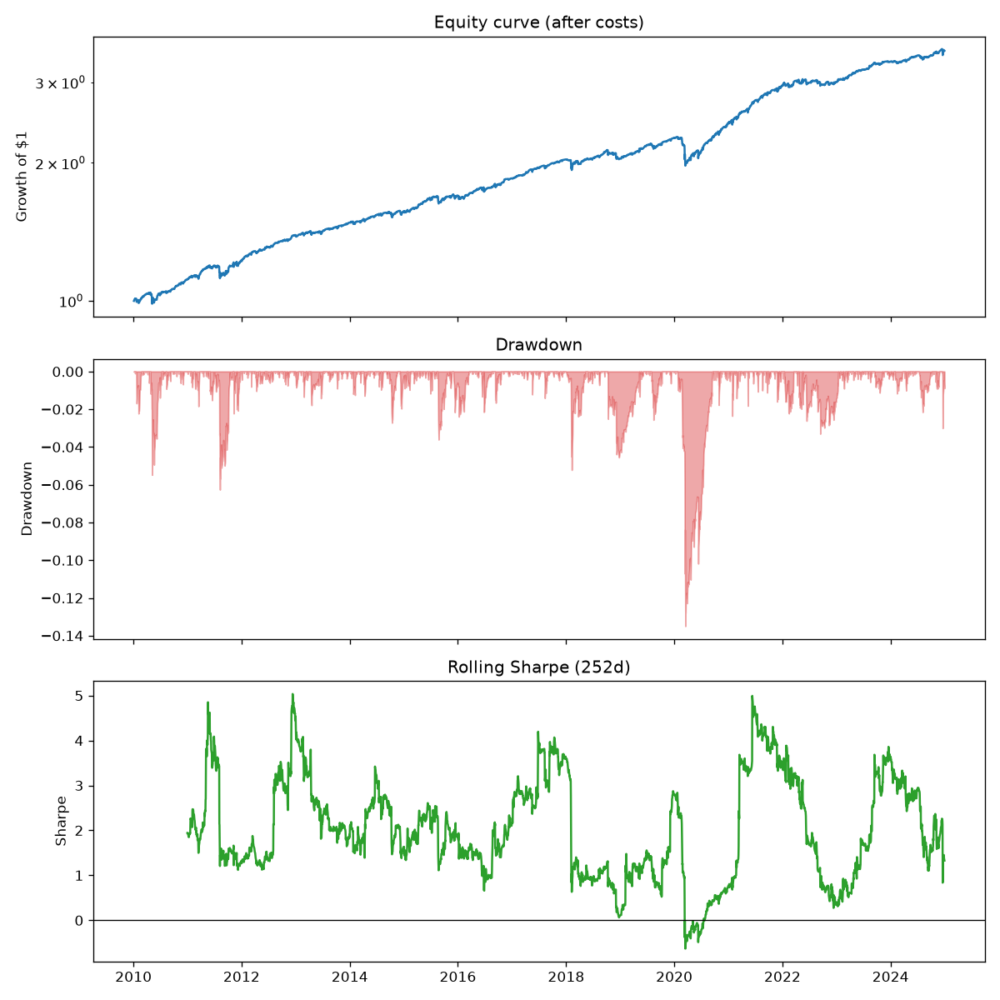
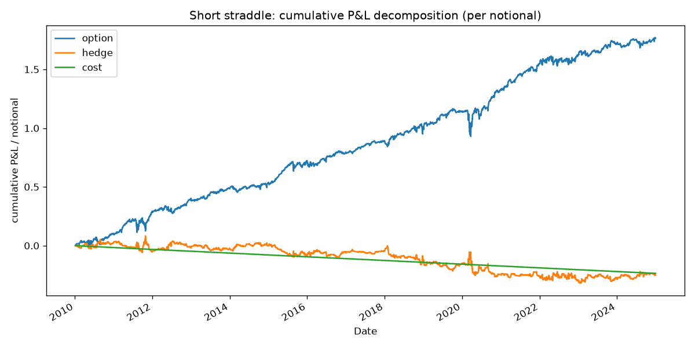

# quantbt — a walk-forward backtester with three strategies

A small, reproducible backtesting framework for systematic strategies, built to
measure performance the way a trading desk would: **walk-forward, after costs,
with turnover, capacity, and tail risk** — not just a pretty gross equity curve.

The reusable engine is the point; three strategies — cross-sectional momentum,
ETF pairs / statistical arbitrage, and a delta-hedged short-volatility straddle —
are plug-ins that exercise it. The honest findings differ by design: the two
equity strategies deliver thin edge after costs, while the delta-hedged short
straddle earns a genuine **variance risk premium** (Sharpe ~1.4–1.6 after costs)
in exchange for a fat left tail. The framework makes all of that visible.

## Why

It's easy to produce a backtest that looks great on gross returns and falls
apart once you account for transaction costs, look-ahead, and capacity. I wanted
to build the disciplined evaluation machinery first — realistic costs, no
look-ahead, walk-forward out-of-sample testing — and then run two well-known
strategies through it and report whatever I found, good or bad.

## Install & reproduce

```bash
python -m venv .venv && source .venv/bin/activate
pip install -e ".[dev]"

pytest -q                      # 41 unit tests
python scripts/run_momentum.py # momentum backtest + plots
python scripts/run_pairs.py    # pairs / stat-arb backtest + plots
python scripts/run_straddle.py # short-vol straddle backtest + plots
```

Price data is cached as CSV under `data/` and committed, so the scripts run
offline and reproduce the committed results in `results/`.

For a narrative walkthrough of each strategy (signal → weights → after-cost
backtest, with inline plots), see the notebooks in `notebooks/`.

## Methodology

- **No look-ahead.** Positions decided at a day's close earn the *next* day's
  return; signals only ever use past data. There's an explicit unit test for it.
- **Walk-forward.** Parameters are estimated on a rolling training window and
  traded on the following, non-overlapping out-of-sample window.
- **After costs.** A proportional cost model (half-spread + commission +
  slippage, in bps) is charged on traded notional at every rebalance. Headline
  numbers are net, and a 1×/2×/3× **cost-sensitivity sweep** shows how the edge
  decays.
- **Capacity & turnover.** Reported alongside returns, because an edge that's
  real but un-tradeable at size isn't an edge.

## Results

### 1. Cross-sectional momentum

12-1 momentum (trailing 12-month return skipping the last month) on 90 liquid US
large-caps, 2015–2024. Long top decile / short bottom decile, equal-weighted,
dollar-neutral, monthly rebalance.

| Metric | After costs |
|---|---|
| Annualized return | 0.5% |
| Annualized vol | 12.9% |
| Sharpe | 0.10 |
| Sortino | 0.14 |
| Max drawdown | −33.3% |
| Hit rate | 47.0% |
| Monthly turnover | 27.1% |
| Capacity (1% ADV) | ~$34M |

Cost-sensitivity sweep:

| Costs | Ann. return | Sharpe | Max DD |
|---|---|---|---|
| 0× | 0.7% | 0.12 | −32.9% |
| 1× | 0.5% | 0.10 | −33.3% |
| 2× | 0.3% | 0.09 | −33.7% |
| 3× | 0.1% | 0.07 | −34.0% |



**Read:** the edge is thin even gross (Sharpe ~0.12) and barely survives costs.
~90 mega-caps that mostly rose together offer little cross-sectional dispersion
to exploit, and 2015–2024 was a weak stretch for momentum. Capacity is bound by
the least-liquid name in the universe — dropping a few of those would raise it
substantially.

### 2. ETF pairs / statistical arbitrage

Five economically-motivated pairs (chosen a priori, not screened across all
combinations). Each is traded only when it tests as **cointegrated in the
training window** (Engle-Granger, p < 0.05); otherwise the strategy stands aside.
We fit the hedge ratio and spread statistics in-sample and trade the spread
z-score out-of-sample (enter at |z|>2, exit near 0, stop at |z|>4).

Per-pair diagnostics (full-sample cointegration, walk-forward Sharpe):

| Pair | Cointegration p | Half-life (days) | Sharpe |
|---|---|---|---|
| EWA/EWC | 0.019 | 36 | 0.22 |
| GDX/GDXJ | 0.594 | 174 | −2.43 |
| XLE/XOP | 0.955 | 1267 | 0.32 |
| SMH/SOXX | 1.000 | ∞ | 0.46 |
| SPY/IVV | 0.497 | 10 | −1.60 |

Combined, equal-split portfolio (after costs):

| Metric | After costs |
|---|---|
| Annualized return | 0.2% |
| Annualized vol | 1.1% |
| Sharpe | 0.18 |
| Sortino | 0.30 |
| Max drawdown | −3.3% |
| Turnover (daily) | 1.5% |



**Read:** only EWA/EWC (Australia vs Canada) is robustly cointegrated. The
cointegration gate keeps the book flat much of the time, producing a low-vol,
low-return hedged portfolio — thin edge after costs. SPY/IVV is a nice cautionary
case: nearly identical trackers whose spread is too tight to trade profitably
once you pay to cross it.

### 3. Volatility: delta-hedged short straddle

Sell a rolling 1-month at-the-money SPX straddle priced off VIX (the implied vol)
and **delta-hedge it daily** against the index, 2010–2024. This harvests the
**variance risk premium** — implied vol systematically exceeds realized because
investors overpay for crash insurance — with market direction hedged out.

| Metric | After costs (1 vol-pt spread) |
|---|---|
| Annualized return | 8.8% |
| Annualized vol | 5.3% |
| Sharpe | 1.62 |
| Sortino | 1.96 |
| Max drawdown | −13.5% |
| Hit rate | 70.1% |

Cost-sensitivity sweep (option bid-ask, in vol points) — the edge survives even a
conservative spread:

| Spread | Ann. return | Sharpe | Max DD |
|---|---|---|---|
| 0 | 10.3% | 1.89 | −13.3% |
| 0.5 | 9.5% | 1.76 | −13.4% |
| 1.0 | 8.8% | 1.62 | −13.5% |
| 2.0 | 7.3% | 1.35 | −13.7% |

Tail risk — the catch, and the reason the premium exists:

| Skew | Excess kurtosis | Worst day | CVaR 95% | CVaR 99% |
|---|---|---|---|---|
| −4.6 | 55 | −5.6% | −0.9% | −2.0% |




**Read:** this is the one strategy that earns a real, durable premium — Sharpe
~1.4–1.6 after costs, robust to the assumed spread. But the Sharpe flatters it:
returns are strongly left-skewed (−4.6) with enormous kurtosis, because you are
**selling insurance**. The −13.5% drawdown clusters in Feb 2018 and March 2020 —
the delta-hedge contains direction, but not the gamma losses on big moves. The
premium is real and so is the tail, which is precisely why it pays. Caveat: the
headline is optimistic — options are priced synthetically off VIX with a modelled
spread, not a real historical option chain.

## What it shows (and where it breaks)

- **Momentum.** Decays under costs; suffers sharp reversals ("momentum crashes")
  visible in the drawdown. The fixed, present-day universe also carries
  **survivorship bias**, so even this modest result is optimistic.
- **Pairs.** Cointegration that holds in-sample often weakens out-of-sample;
  gating on it is what separates a real relationship from a spurious one. In
  liquid ETFs most of the relative-value edge appears arbitraged away.
- **Short volatility.** The only genuine premium of the three — because it is
  *compensation for tail risk*, not a crowded anomaly. The delta-hedge isolates
  the variance premium; the steep negative skew and kurtosis are the price of the
  Sharpe, and reporting them honestly matters more than the Sharpe itself.
- **All three.** The value isn't a magic number — it's that the measurement is
  honest: net of costs, free of look-ahead, sized against capacity, and explicit
  about the tail.

## Limitations

- Daily close-to-close; weights held fixed between rebalances (no intra-period
  drift modeled).
- Proportional cost model, not a full market-impact model.
- Survivorship bias in the momentum universe (disclosed, not corrected).
- A priori pairs to sidestep multiple-testing; a broad cointegration screen would
  need a correction.
- The short-vol straddle prices options synthetically off VIX (no historical
  option chain), so its headline overstates a live implementation that pays the
  real option bid-ask.

## Layout

```
src/quantbt/      data, metrics, costs, backtest engine, plotting, blackscholes, strategies/
scripts/          run_momentum.py, run_pairs.py, run_straddle.py
notebooks/        narrative walkthroughs (momentum, pairs, short-vol)
tests/            41 unit tests (metrics, costs, engine, strategies, black-scholes)
data/             committed price/volume CSVs
results/          committed metrics tables and tearsheets
```
